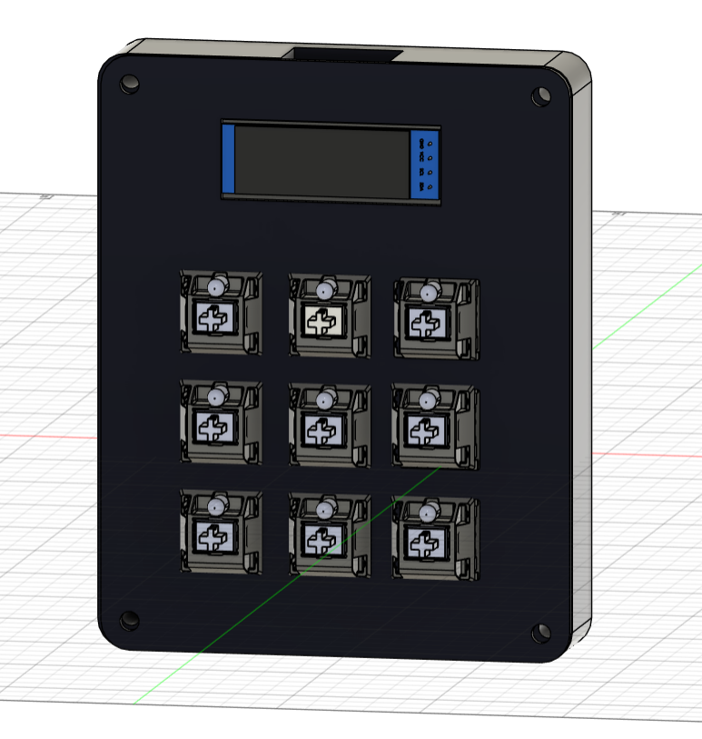
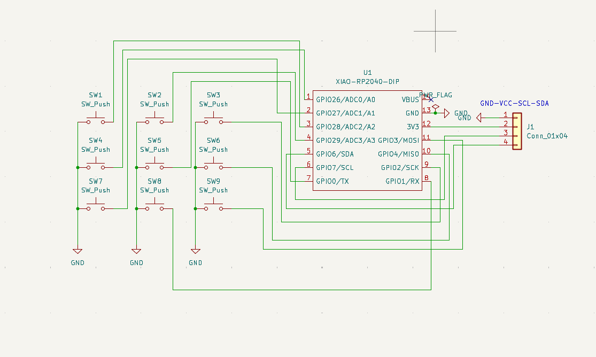
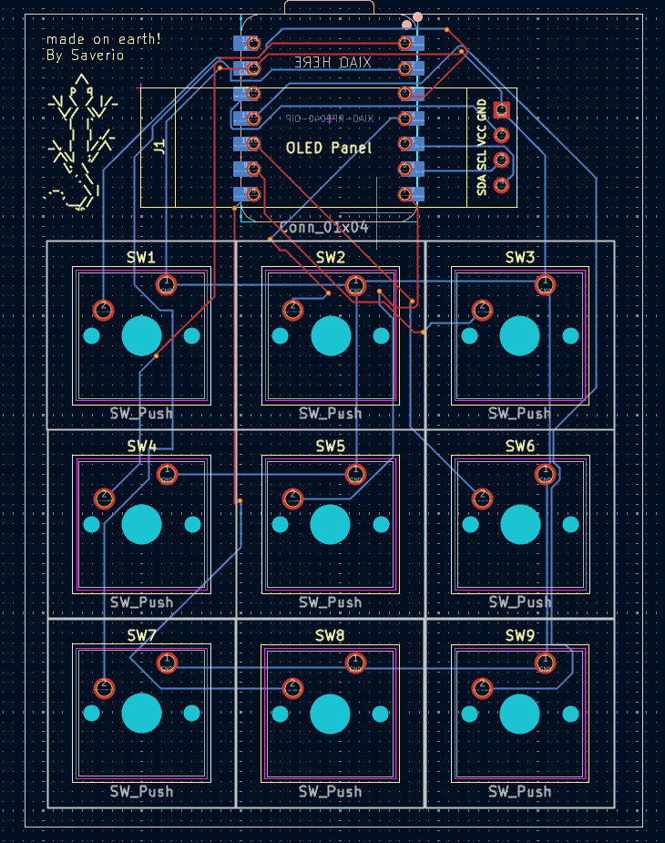
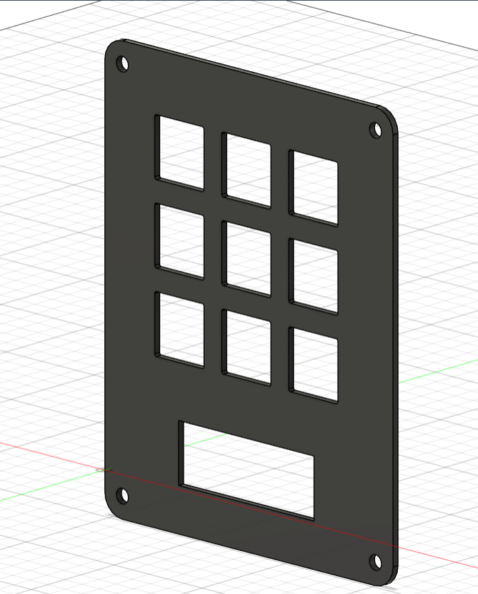

# Hackpad MK2 by Saverio

This repository has all the files required for the 'Hackpad MK2' project, a custom 9 key macro pad that enhance productivity and provides a high level of customization.

Features:
1. 3x3 mechanical switch matrix (9 keys)
2. 0.91" OLED screen (SSD1306 controller)
3. RP2040 microcontroller
4. CircuitPython compatible

# About Hackpad

Hackpad MK2 has an elegant and compact design. It can be used as a dedicated keyboard for shortcuts, functions or command macros.

# Schematic

Created with KiCad, this wiring diagram provides the connection for the 9 independent buttons and the OLED screen using an I2C interface. Each button is wired to an independent GPIO inside the RP2040. As usual, the screen uses its normal GND, VCC, SCL and SDA pinout

# PCB

The focus was on a clean design and a clear assembly. The board has custom silkscreening and wide copper tracks for better electrical performance

# Case

The case was designed in two parts, base and top, both suited to be printed. They fit perfectly on the PCB.

# BOM
| Component | Quantity | Description |
| ----------------------- | -------- | ---------------------------- |
| Mechanical Switches | 9 | MX-Style Switches |
| Keycaps | 9 | Compatible with MX Switches |
| RP2040 Microcontroller | 1 | e.g. Seeed XIAO RP2040 |
| 0.91" OLED Display | 1 | 128x32 with I2C Interface |
| Custom PCB | 1 | Hackpad MK2 Design |
| 3D Printed Case | 1 | Base + Cover |

# Libraries Needed
1. adafruit_display_text
2. adafruit_ssd1306
3. adafruit_hid

## License
This project is open-source and was created by Saverio Martino.
